The Microsoft Band SDK
======================

Microsoft Band SDK gives developers access to the sensors available on
the band, as well as the ability to create and send notifications to
tiles. These capabilities allow you to enhance and extend the experience
of your applications to your customers' wrists. This workshop will take
you through some of the steps needed to create applications that use the
Microsoft Band. For more detailed information, see the Microsoft Band
SDK documentation here: <http://developer.microsoftband.com/>.

You can copy the code from this document by *double clicking* the code
box. This will bring up a separate window from which you can copy the
code. Simply close this separate window when you’re done.

Getting Started
===============

For this and the following labs, we will be working in Microsoft Visual
Studio with a solution called HelloBand.sln. This solution contains a
C\# test harness application that we will be building upon with each
step. Let’s start by opening this file which can be found in a folder on
your desktop. If you can’t find the file, your lab instructor can help.

1.  Open **HelloBand.sln**

2.  Rebuild the solution to make sure that everything
    compiles correctly.

3.  Inspect the solution. You’ll notice that it is a Universal Windows
    Platform (UWP) application. The key component that you’ll need for
    developing Microsoft Band applications is the Microsoft Band nuget
    package: <https://www.nuget.org/packages/Microsoft.Band/>.

4.  Run the **HelloBand** application and you should see the following.

5.  Close the application.

> 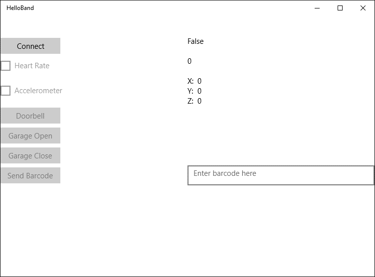{width="6.5in" height="4.805555555555555in"}

Connect to the Microsoft Band
=============================

The **HelloBand** application is written using the MVVM pattern. For the
exercises in this workshop we’ll use the test harness and fill in
Microsoft Band specific code. Let’s add some code to connect to the
Band. NOTE: If you have issues connecting to the Band, your instructor
can help. The Band should be paired via Bluetooth to your computer for
these labs to work.

The Microsoft Band APIs are presented via a series of *manager* classes.
Each Manager class has an associated interface making it easy to create
a mock or stub for unit testing purposes.

We’ll start with the **BandClientManager**. The **BandClientManager** is
a singleton class exposed via:

BandClientManager.Instance.

In the test harness, we have passed this into the constructor of the
**MainPageViewModel**.

1.  In the Visual Studio Solution Explorer find and open the
    **MainPageViewModel.cs** file.
    {width="3.5620548993875767in"
    height="4.093238188976378in"}

2.  You’ll notice that the **BandClientManager** instance is passed into
    the constructor of the view model. This is stored in a member
    variable for later use. Let’s add a function called
    **ConnectToFirstBand** that will enumerate the bands and return the
    first Band in the list:\
    Most of the methods that you’ll encounter in the Microsoft Band API
    are asynchronous, so you’ll want to use the C\# async/await pattern.
    Additional information is at the following link:

    a.  <https://msdn.microsoft.com/en-us/library/hh191443.aspx>

3.  Now we have a function that can get us a band and connect to it.
    Let’s add code to call that function when the **Connect** button
    is pressed. Locate the **OnConnectionExecute** function. This
    function is part of an **ICommand** implementation. Your instructor
    can give you more information on command binding. You can also find
    information here:

    a.  <https://code.msdn.microsoft.com/windowsapps/Button-Command-Binding-in-436a5968>

    b.  <https://msdn.microsoft.com/en-us/library/windows/apps/windows.ui.xaml.input.icommand.aspx>

        For now, let’s add the following code:

        Run the code and try the connect button. If everything works
        correctly, you should see the following dialog with the name and
        ID of your band: 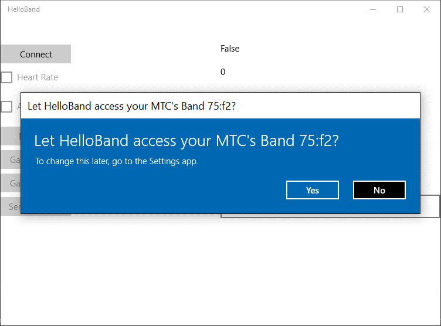{width="6.5in"
        height="4.805555555555555in"}

        Click *Yes* to allow access to the Band. You’ll notice that the
        **Connect** button is the only control that is enabled.

4.  Our next step is to enable the other buttons of the test harness.
    Add the following code inside of the **if (IsConnected)** statement
    after a successful connection and retest. This is part of the
    **ICommand** pattern and will allow each control to enable itself
    based on conditions that were set in the constructor. The additional
    buttons should now be enabled.

Reading Band Sensors
====================

The Microsoft Band provides a very advanced sensor package in a small
size. Making use of the Band sensors in your applications is
straightforward. Let’s first take a look at the available sensors:

  ------------------------------------------------------------------------------------------------------------------------------------------------------------------------------------------------------------------------------------------------------------------------------------------------------------------------------------------
  > Sensor Stream   Details                                                                                                                                                                                                                                                                                                   Frequency
  ----------------- --------------------------------------------------------------------------------------------------------------------------------------------------------------------------------------------------------------------------------------------------------------------------------------------------------- --------------
  Accelerometer     Provides X, Y, and Z acceleration in g units. 1 g = 9.81 meters per second squared (m/s^2^).                                                                                                                                                                                                              62/31/8 Hz

  Gyroscope         Provides X, Y, and Z angular velocity in degrees per second (°/sec) units.                                                                                                                                                                                                                                62/31/8 Hz

  Distance          Provides the total distance in centimeters, current speed in centimeters per second (cm/s), current pace in milliseconds per meter (ms/m), and the current                                                                                                                                                1 Hz

                    pedometer mode (such as walking or running).                                                                                                                                                                                                                                                              

  Heart Rate        Provides the number of beats per minute; also indicates if the heart rate sensor is fully locked on to the wearer’s heart rate.                                                                                                                                                                           1 Hz
                                                                                                                                                                                                                                                                                                                              
                    The data returned should be used only in resting mode. The SDK doesn’t provide access to the heart rate values optimized for any other activity.                                                                                                                                                          

  Pedometer         Provides the total number of steps the wearer has taken since the Band was last factory-reset. This is a lifetime counter and not a daily or a 0-based counter. To determine the absolute number of steps between two readings, you must take the difference between the returned values.                 Value change

  Skin              Provides the current skin temperature of the wearer in degrees Celsius.                                                                                                                                                                                                                                   1 Hz
                                                                                                                                                                                                                                                                                                                              
  Temperature                                                                                                                                                                                                                                                                                                                 

  UV                Provides the current ultraviolet radiation exposure intensity.                                                                                                                                                                                                                                            1 Hz

  Band Contact      Provides the current state of the Band as being worn/not worn.                                                                                                                                                                                                                                            Value change

  Calories          Provides the total number of calories the wearer has burned since the Band was last factory-reset. This is a lifetime counter and not a daily or a 0-based counter. To determine the absolute number of calories burned between two readings, you must take the difference between the returned values.   Value change

  Galvanic Skin     **(Microsoft Band 2 only)** Provides the current skin resistance of the wearer in kohms.                                                                                                                                                                                                                  0.2 Hz
                                                                                                                                                                                                                                                                                                                              
  Response                                                                                                                                                                                                                                                                                                                    

  RR Interval       **(Microsoft Band 2 only)** Provides the interval in seconds between the last two continuous heart beats.                                                                                                                                                                                                 Value change
                                                                                                                                                                                                                                                                                                                              
                    The data returned should be used only in resting mode. The SDK doesn’t provide access to the RR interval values optimized for any other activity.                                                                                                                                                         

  Ambient Light     **(Microsoft Band 2 only)** Provides the current light intensity (illuminance) in lux (Lumes per sq. meter).                                                                                                                                                                                              2 Hz

  Barometer         **(Microsoft Band 2 only)** Provides the current raw air pressure in hPa (hectopascals) and raw temperature in degrees Celsius.                                                                                                                                                                           1 Hz

  Altimeter         **(Microsoft Band 2 only)** Provides current elevation data like total gain/loss, steps ascended/descended, flights ascended/descended, and elevation rate.                                                                                                                                               1 Hz
  ------------------------------------------------------------------------------------------------------------------------------------------------------------------------------------------------------------------------------------------------------------------------------------------------------------------------------------------

Heart Rate
----------

Now let’s add some code to read the Heart Rate sensor. As with
connecting to the Band, we need to make use of one of a manager class.
In this case it’ll be the **SensorManager**. Before we can access a
sensor we need to get consent from the user. We need to do this for
every sensor individually. For example, if we want to read the heart
rate sensor, we would use the following code to check whether we have
permission:

The return type is an **enum** that looks like the following:

If we don’t have permission, we use the **RequestUserConsentAsync**
method to ask for permission to access the sensor. The Band API will
show the user a standard consent dialog. Consent for a given application
only needs to be given once. That’s why in our code, we first test to
see if the application has consent before requesting consent.

1.  Let’s add a function that gets user consent to read the Heart
    Rate sensor.

2.  Now let’s add code to subscribe to the heart rate sensor. We’ll make
    use of the **SensorManager** to connect to a callback method and
    start reading the sensor. Add the following code to
    **OnSubscribeToHeartRateExecute**:

3.  Also add the following callback method. This method is called
    whenever the band has a sensor reading to report and simply sets the
    text in our test harness display to the sensor reading. You can use
    Visual Studio’s Intellisense to examine the payload for each sensor
    type and refer to the Microsoft Band SDK documentation to get
    details on the units and interpretation of sensor data.

4.  Run the application and check the box for Heart Rate. You should see
    the following permission dialog:

> 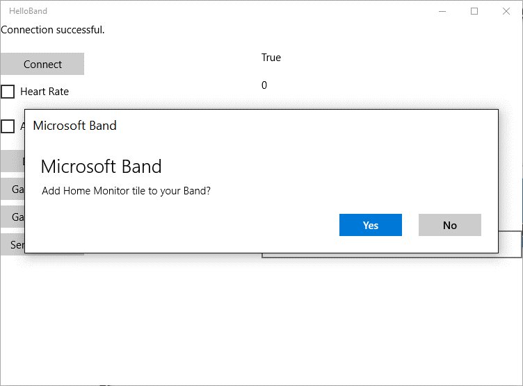{width="6.5in" height="4.805555555555555in"}

1.  Click *Yes* to allow the application to access the Band sensors.

Accelerometer
-------------

Now that you’ve seen how to read the Heart Rate, try your hand at
reading the accelerometer before you incorporate the code below.

Questions:

1.  Share your observations about reading Band sensors.

2.  Is there code that you can make more generic?

3.  Can you change the rate at which you receive sensor data?

Now that you’ve tried on your own, here’s a possible solution to reading
the acdcelerometer:

Note the use of the generic function **GetUserConsentAsync**:

Adding a Tile to the Band
=========================

The visual user interface on the Microsoft Band is based on
application-specific tiles that display data to the user. Interaction
with tiles is done via the **TileManager** class. Using the
**TileManager** allows us to do the following:

-   Get a list of the application’s tiles that are currently on the Band

-   Get the number of available tile slots on the Band

-   Create a tile

-   Remove a tile

Creating the user interface elements for the Band tile is normally done
via code. There is a new visual tile designer for the Microsoft Band
that can be found here:
<https://visualstudiogallery.msdn.microsoft.com/90d69a44-7a8c-4324-bdcb-713c28c9658d>.
The Visual Designer is installed on the lab machines. Let’s use it to
create a tile for the Band.

1.  In the Solution Explorer in Visual studio, right click on the
    **BandTiles** folder and click Add | New Item.

2.  Add a “Microsoft Band Tile Layout”. Call the new layout
    **GarageDoorStatusLayout**.

> 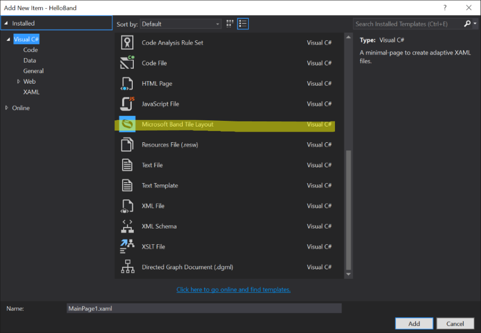{width="6.5in" height="4.5055555555555555in"}

1.  Using the Toolbox add a **FLowPanel** to the layout. You may also
    need to build the project before the next step.

> 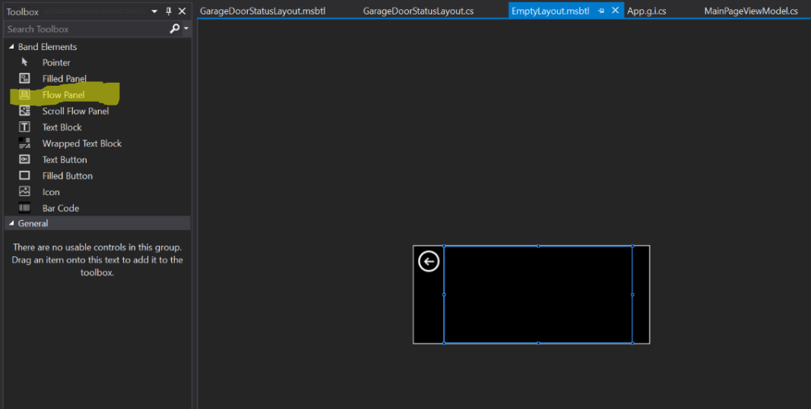{width="6.5in" height="3.283333333333333in"}

1.  Add **GarageDoorStatusLayout** to the **MainPageViewModel**:

2.  Add the following code to install the tile onto the band. Some
    things to note:

    a.  For your application, you should generate new GUIDs for the Tile
        Id and the Page Id(s).

    b.  We have some test icons for your tile, but you should create
        your own 24x24 small icon and 48x48 large icon. See the
        Microsoft Band SDK documentation or more details about designing
        an icon.

3.  Modify **OnConnectExecute** to look like this:

4.  You now have a tile ready for the band. It doesn’t do much, but
    let’s test it anyway. Run the application and you should see the
    following:

> {width="6.5in" height="4.805555555555555in"}

1.  Click *Yes* to add the tile to the band. Notice

Sending messages to the Band
============================

Next let’s send some data to the Microsoft Band. Dialogs and Messages
are sent to the Band using the Notification Manager. Dialogs and
Messages both contain a title and body text. Messages include a
timestamp that is used to determine the display order for messages.
Dialogs must be acknowledged by the user and do not persist after they
are dismissed. By contrast, the last 8 messages are persisted on the
Band. Messages can be sent with an optional dialog.

1.  Let’s modify the code for **OnDoorbellRingExecute** to send a
    message to the band when the *Doorbell* button is pressed:

2.  Run the application and try pressing the doorbell button. You’ll
    notice that we get prompted again for adding the tile to the Band.
    This would not normally happen with an application, but we added
    code to remove the tile each time we run. During a test and
    development phase this ensures a clean working environment each time
    we run.

3.  Try sending messages with and without dialogs

4.  Try sending dialogs using
    **bandClient.NotificationManager.ShowDialogAsync**.

5.  Explain the difference between **SendMessageAsync** and
    **ShowDialogAsync**.

Custom Tile Layouts
===================

Microsoft Band tiles can each contain up to 8 pages of content. When the
user taps the tile, the first page is shown. The user can swipe
horizontally to navigate to other pages in the tile.

For custom tiles, the layout defines the visual elements, but we still
need a way to send data to them. That’s accomplished by using the
**TileManager.SetPagesAsync** method. This method takes in a tile GUID,
and a payload for the elements that we’re setting. That payload is of
the **PageData** type which specifies the page instance, the layout id,
and an array of **PageElementData** structures which hold the element id
and content payload. Element data payload consists of following data
types:

  Element Type       Content Data Type      Content Description
  ------------------ ---------------------- ------------------------------------------------------------------------------
  TextBlock          TextBlockData          String to display
  WrappedTextBlock   WrappedTextBlockData   String to display
  Icon               IconData               Icon index (0-9 for Microsoft Band 1 and 0-14 for Microsoft Band 2) to rende
  Barcode            BarcodeData            String and BarcodeType to render
  TextButton         TextButtonData         String to display
  FilledButton       FilledButtonData       Color to display when the button is being pressed

For more details, see the Microsoft Band SDK Documentation.

Let’s use the Band Tile Designer to customize the layout of a page then
we’ll send some data to it.

1.  Open **GarageDoorStatusLayout** in the Tile Designer by
    double-clicking it in the Solution Explorer.

2.  Add 3 **TextBoxes** to the **FlowPanel** that you added last time.
    Your layout page should look like this:

> 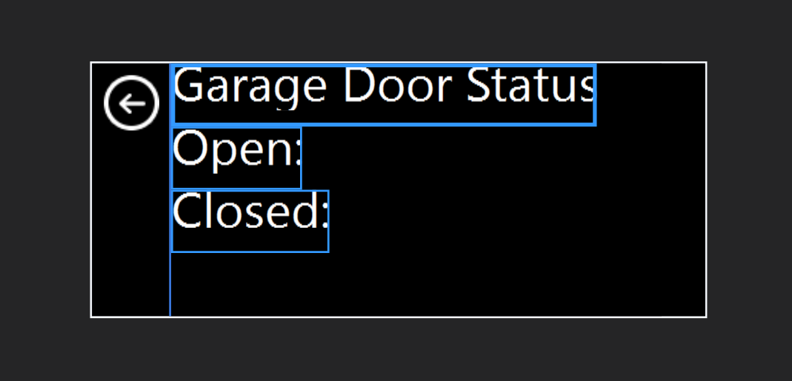{width="6.5in" height="3.1319444444444446in"}

1.  Now let’s name the **TextBoxes**. If the properties window is not
    showing in Visual Studio, use View | Properties Window to show it.
    Use the Properties Window to set the name of the first text box to
    Title:

> 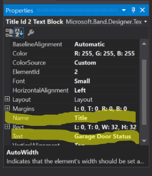{width="3.0933628608923884in"
> height="3.582884951881015in"}

1.  Repeat this for other two, naming them **OpenTime** and
    **CloseTime**.

2.  Locate the **OnGarageOpenExecute** function in the
    **MainPageViewModel**. Add the following code:

> Notice that we can rely on code generated by the Layout Designer to
> build the array of **PageElementData** for us. Take a moment to
> inspect the generated code from the Layout Designer in the file
> **GarageDoorStatusLayout.cs**. In particular look at the
> **PageLayoutData** class.

1.  Run the test harness application and press the **Connect** button to
    reinstall the tile and connect to the Band. Next press the **Garage
    Open** button. You should get an alert dialog on the Band. Dismiss
    the dialog and navigate to the **Home Monitor** tile. If you tap to
    enter the tile, you’ll see our custom UI with a garage door
    open time.

2.  Try coding the **OnGarageDoorCloseExecute** function and testing
    both open and close functions within the test harness.

Custom Tile Events
------------------

In addition to being able to subscribe to sensors and send data to the
Band, your application can also get notifications when a user interacts
with your Band Tile’s user interface. There are 3 even notifications
that your application can receive:

  ---------------------------------------------------------------------------------------------------------------------------------------------------
  Event            Data Received                                                  Description
  ---------------- -------------------------------------------------------------- -------------------------------------------------------------------
  Tile Entered     -   GUID of the tile that generated the event.                 Generated when the user taps a tile to open it.
                                                                                  
                                                                                  

  Tile Exited      -   GUID of the tile that generated the event.                 Generated when the user taps the *Back* button to exit a tile.
                                                                                  
                                                                                  

  Button Pressed   -   GUID of the tile that generated the event.                 Generated when the user presses a button on a custom tile layout.
                                                                                  
                   -   GUID of the custom layout page that contains the button.   
                                                                                  
                   -   Element ID of the button.                                  
                                                                                  
                                                                                  
  ---------------------------------------------------------------------------------------------------------------------------------------------------

1.  Let’s add code to get tile enter and exit notifications. We’ll use
    the **TileManager** and add event handlers for **TileOpened** and
    **TileClosed**, then we’ll start listening for events using
    **bandClient.TileManager.StartReadingsAsync**. Add the following
    code to the **MainPageViewModel**:

2.  Add a call to **AddTileEventHandlers** to the
    **OnConnectionExecute** method. That method should now look like
    this:

3.  Run the test application and tap the tile on the band after
    it deploys. You should see a status message on the test application
    when you tap to enter or leave the tile.

> 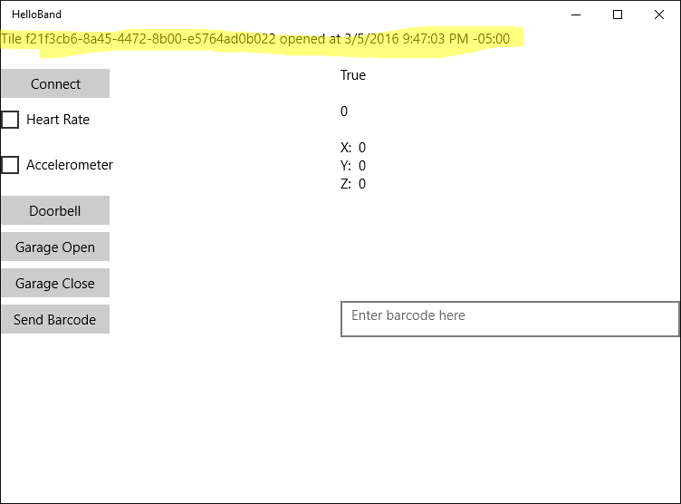{width="6.5in" height="4.805555555555555in"}

1.  Now let’s create a new layout that has some buttons on it. These
    will be for opening and closing the garage door. Add a new layout by
    right clicking on the **Band Tiles** folder in the solution explorer
    and choosing **Add | New Item…**

> 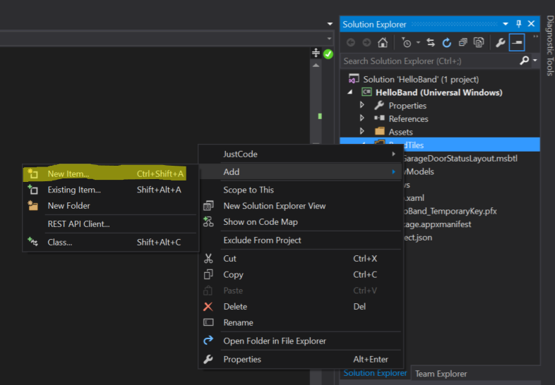{width="6.5in" height="4.514583333333333in"}

1.  Choose **Microsoft Band Layout** and name the new layout
    **GarageControlsLayout.msbtl**.

2.  Click **Add***.*

3.  Add a **Flow Panel** and two buttons to the layout. Add margins to
    the buttons and change the text so that your layout looks like the
    following:

> 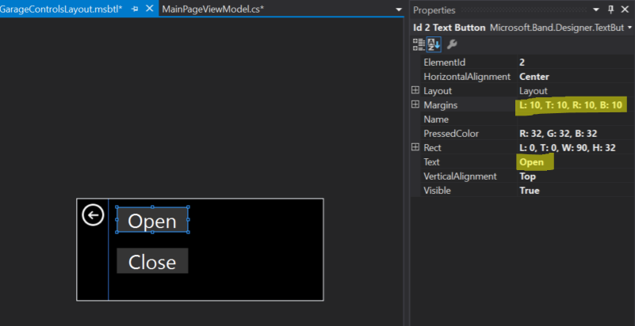{width="6.5in" height="3.3430555555555554in"}

1.  Compile the code to make sure that the layout file
    builds successfully.

2.  Add the new layout at the top of the **MainPageViewModel**:

3.  Modify **AddTileToBand** to include the new layout in the list of
    layouts for the tile. You’ll also have to add code to send
    **PageData** to force the controls page to display.

4.  Now let’s add code to handle the button press events. We’ll modify
    **AddTileEventHandlers** to look like this:

5.  Now run the application and allow the tile to update. Navigate to
    the tile and you should see our new layout with garage
    door controls. Try tapping one of the buttons to see the message on
    the test application.

> 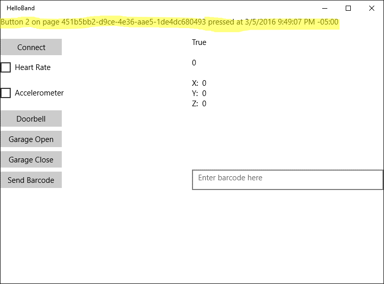{width="6.5in" height="4.805555555555555in"}

Barcodes (optional)
-------------------

The Microsoft Band supports displaying two different types of barcodes

-   PDF417 – <https://en.wikipedia.org/wiki/PDF417>

-   CODE39 – <https://en.wikipedia.org/wiki/Code_39>

The maximum length of a barcode is 39 characters, but based on the band
screen resolution and depending on the characters uses, fewer characters
may fit on the screen. The Microsoft Band SDK documentation give more
details on the limits of barcodes on the Microsoft Band.

Barcodes are set by adding a barcode element to a Band page layout and
setting the barcode value as a string. Let’s add a barcode page to our
test application.

1.  Follow the same procedure that you used in the previous lab to add a
    new layout to the HelloBand project:

    a.  Right click on **Band Tiles**

    b.  Choose **Add | New Item…**

    c.  Select **Microsoft Band Tile Layout** and name the new layout
        **BarcodeLayout.msbtl**

    d.  Click **Add** to add the layout to the project

> 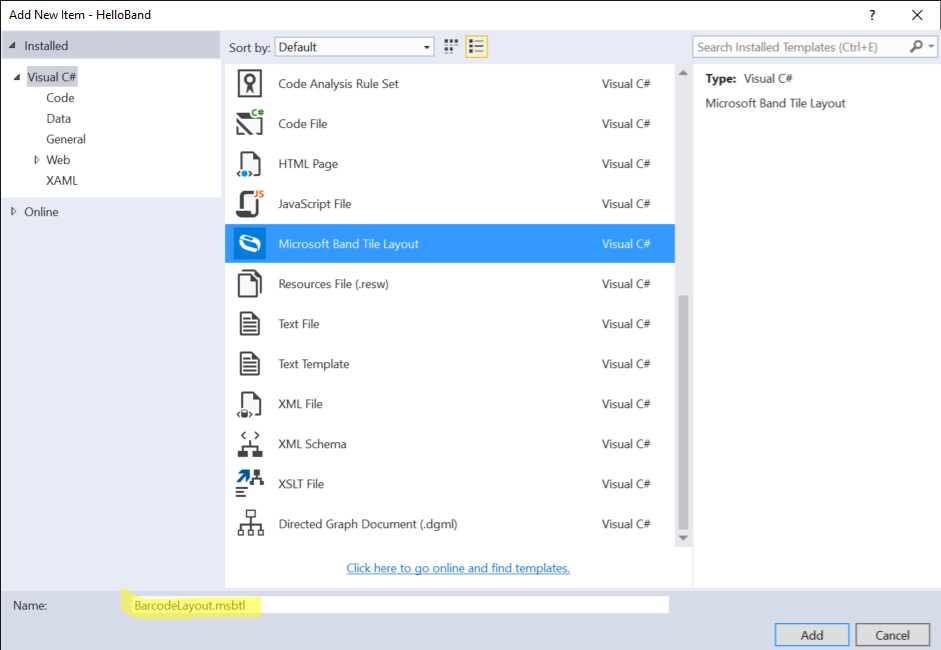{width="6.5in" height="4.489583333333333in"}

a.  Add a **Flow Panel** to the new layout

b.  Add a **Barcode** element to the **Flow Panel**

c.  Change the barcode type to **Code39**

d.  Name the barcode element **ScanCode**

e.  Set the rectangle of the barcode element to **L:0, T:0, W:248,
    H:128**

> 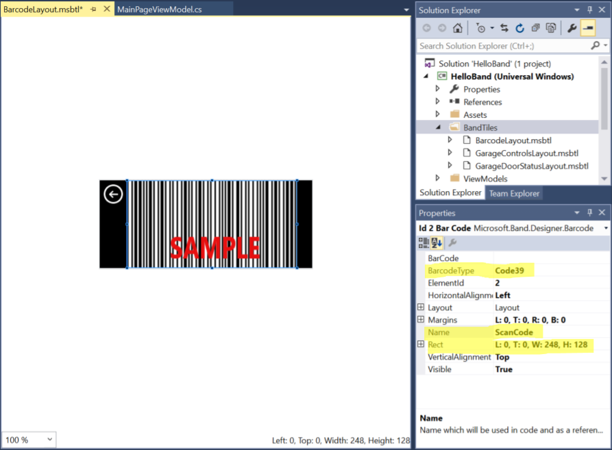{width="6.5in" height="4.781944444444444in"}

a.  Build the project

b.  Update the MainPageViewModel with the following code:

c.  Update the AddTileToBand method to include the barcode in its page
    layouts collection:

d.  Add the following code to the **OnSendBarcodeExecute** method:

e.  Run the application and test out sending barcodes to the band.

f.  (Optional) Add a dialog box alert to the code to signal when the
    barcode is updated.

Haptics
=======

The word *haptic* is defined as something that relates to the sense of
touch. The Microsoft Band implements *haptic feedback* via a vibration
motor in the Band. We can send tactile notifications to the user via the
Band’s **NotificationManager**. The only method we need for this is
**NotificationManager.VibrateAsync**. This method takes as input an enum
of type **VibrationType** that looks like this:

The Band SDK documentation calls these “tones.” Here’s a description of
each value:

  Vibration Tone          Description
  ----------------------- ------------------------------------
  Notification one tone   One gentle notification tone
  Notification two tone   Two gentle notification tones
  Notification alarm      Three long, high-intensity tones
  Notification timer      One long, high-intensity tone
  One tone high           One high-intensity tone
  Two tone high           Two high-intensity tones
  Three tone high         Three high-intensity tones
  Ramp up                 One tone with ascending intensity
  Ramp down               One tone with descending intensity

1.  Modify **OnGarageDoorOpenExecute** to look like the following:

2.  Run the test application and notice the new vibration pattern when
    you click the **Garage Open** button.

3.  Feel free to try different **VibrationType** values.

Cross-Platform Development (Work in Progress)
=============================================

There are several options for cross-platform development with the
Microsoft Band. The Microsoft Band SDK includes native libraries for
Windows Universal Applications, iOS, and Android. If you are developing
for only one of these platforms or are using native tools for each, you
can use these libraries.

Another way to develop cross-platform applications for the Microsoft
Band is to use a tool like Xamarin. Xamarin allows you to use C\# and
.NET to develop applications for Windows, iOS, and Android that share a
great deal of their code.

More information
================

Check out the Microsoft Band Developer web site –
<http://developer.microsoftband.com/> – to get additional information
on:

-   The Band SDK

-   Microsoft Band Web Tiles

-   The Microsoft Health Cloud API

